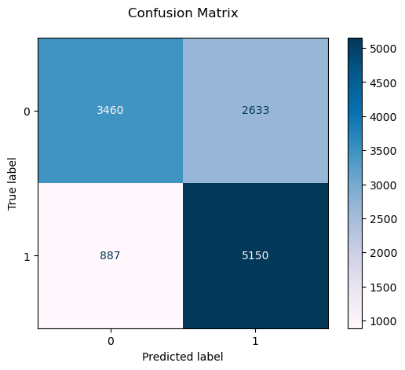
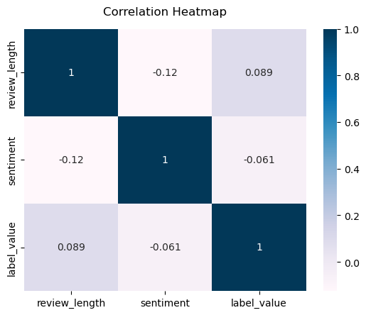
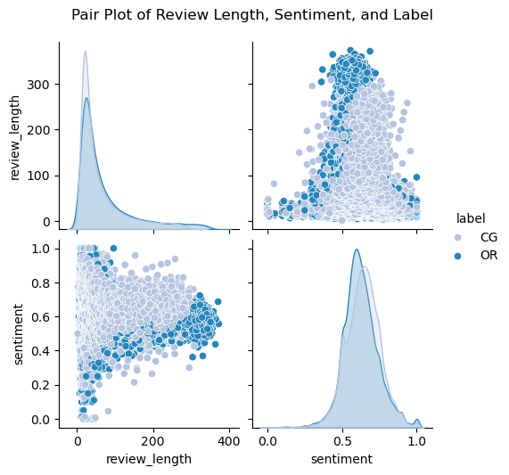

# Fake Review Detector

## Project Summary
This project uses machine learning to develop a fake review detector.

Fake reviews undermine trust between buyers, sellers, and platforms, misleading buyers and damaging credibility. This was developed for an e-commerce platmore as an automated, scalable solution to filter out fake reviews. The solution aims to streamline review moderation, enhance authenticity, and improve user trust on the platform.

## Data Summary
A Kaggle dataset of 40,000 labeled reviews with attributes including product category, rating, and review text was used for this project. Preprocessing included text cleaning, encoding categorical features, calculating review length, and sentiment scoring. The data was divided into training and testing sets for model validation.

## Implementation
Following CRISP-DM and Agile, the project was structured in six phases: Business Understanding, Data Understanding, Data Preparation, Modeling, Evaluation, and Deployment. Using this iterative process allowed continuous improvement and flexibility.

## Visualizations
The following are some examples of data visualization of this project.

This confusion matrix is a visual representation of the performance of the classification model by comparing the predicted and actual classifications. The diagonal cells represent the number of accurately classified data.

    

Correlation heatmap shows the correlation between specific features. In this case, the map is showing correlations between a review's length, its sentiment score, and its current label in the dataset (whether the review was computer-generated or written by a human).
    

    
Pair plot showing the relationship between a review's length and sentiment score across the data points. The plots are set to be colored by the data point's label. Here, CG is for computer-generated reviews and OR is for reviews written by a human.

